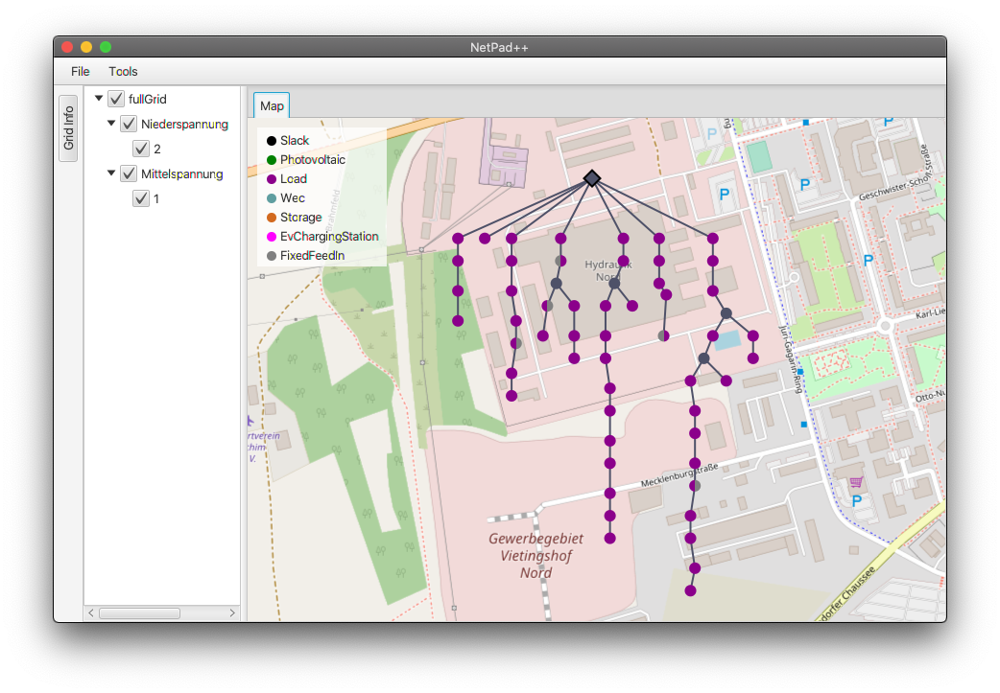

# NetPad++

A simple graphical user interface to allow manipulation of grids that are in PowerSystemDataModel format.
Currently, the editor supports read and write operations from and to .csv-file grid data.

The edit support is currently restricted to drag-and-drop nodes and alter their geo position as well
as renaming them. It is planned to add more features in a "per-request" manner. Please feel free to
use the issue tracker to submit new feature request.
